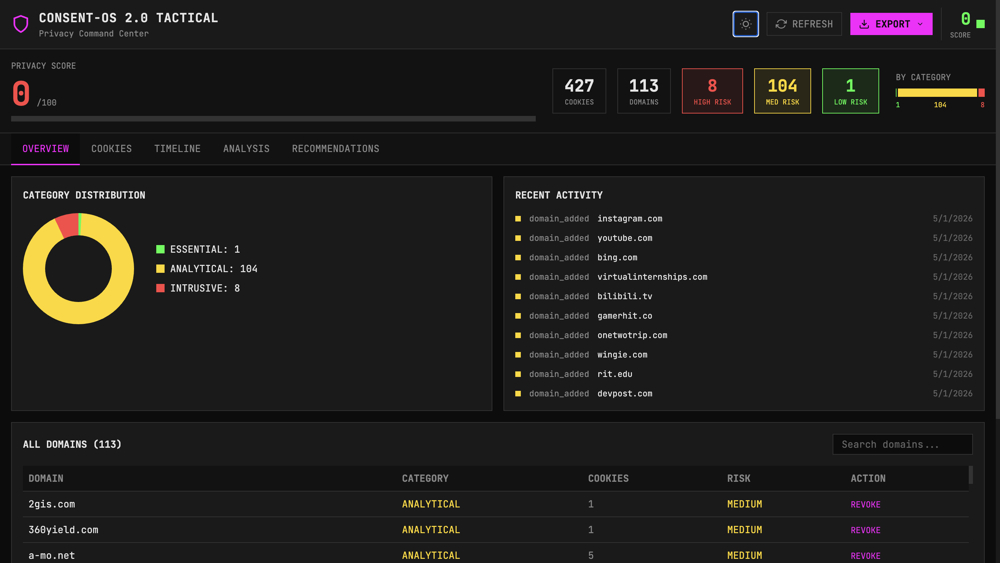
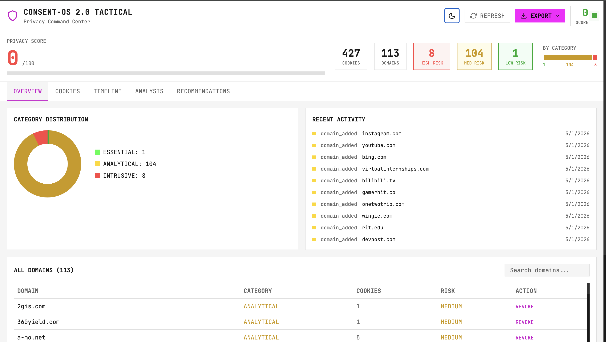
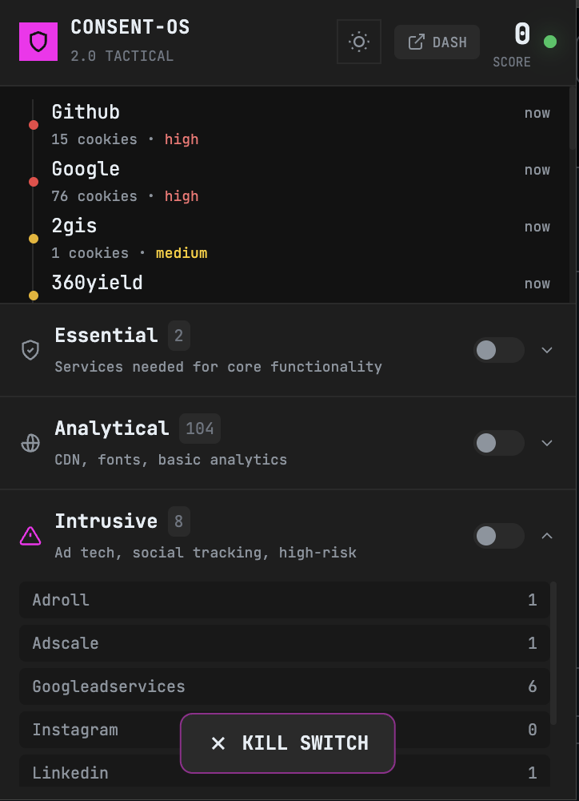
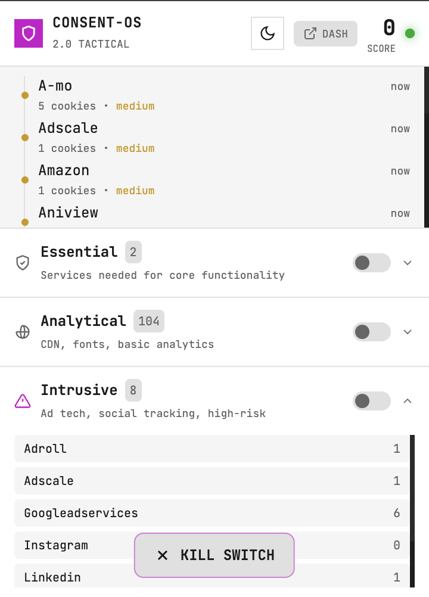

# Consent-os 2.0 TACTICAL

<div align="center">


**Tactical Command Center - Military-Grade Privacy Dashboard for Chrome**

</div>

---

## Overview

Consent-os 2.0 TACTICAL is a Chrome extension that provides a comprehensive privacy management dashboard with a tactical "command center" aesthetic. It scans your browser to identify domains with active data collection (cookies, history, bookmarks, downloads), categorizes them by risk level, and provides powerful tools to manage and revoke permissions.

### Key Capabilities

- **Automatic Domain Scanning**: Discovers all domains with browser data access
- **Tactical Privacy Score**: Aggregate score (0-100) displayed with vibrant green indicator
- **Risk Assessment**: Assigns High/Medium/Low risk scores based on data types
- **Privacy Grading**: Provides A-F transparency scores for each service
- **Permission Management**: Bulk revoke cookies and permissions for any domain
- **Real-time Monitoring**: Tracks cookie creation/deletion events
- **Timeline History**: Complete audit log of all privacy actions with yellow tactical nodes
- **Export Options**: Export data as JSON, CSV, or PDF report
- **Light/Dark Theme**: Toggle between themes with real-time sync between popup and dashboard

---

## Installation

### From Source

```bash
# Clone the repository
git clone https://github.com/parzivalchik/consent-os.git
cd consent-os

# Install dependencies
npm install

# Build the extension
npm run build
```

### Load into Chrome

1. Open Chrome and navigate to `chrome://extensions/`
2. Enable **Developer mode** (toggle in top-right)
3. Click **Load unpacked**
4. Select the `dist` folder (after running `npm run build`)

---

## Features

### TACTICAL Design System

- **Matte Black Background**: Flat #0C0C0C background throughout
- **Neon Magenta Accents**: #FF00FF for branding icons and Kill Switch CTA
- **Cyber Yellow Status**: #FFD700 for timeline nodes and warnings
- **Vibrant Green Score**: #00FF41 for privacy score indicator
- **JetBrains Mono Font**: Strictly monospaced typography
- **Zero Border Radius**: Sharp corners everywhere - no rounded elements
- **1px Thin Borders**: Data-dense modular grid system
- **No Shadows**: Flat design aesthetic

### Privacy Dashboard (React Full-Page)

The new React-based dashboard provides a complete tactical command center with 5 tabs:

1. **Overview Tab**: Category distribution pie chart, all domains table, recent activity feed
2. **Cookies Tab**: Searchable cookie table with domain/type filters, clear individual or all
3. **Timeline Tab**: Vertical yellow timeline with event nodes, filter by event type
4. **Analysis Tab**: Third-party tracker list, data type distribution, risk analysis
5. **Recommendations Tab**: Priority-based actions (High/Medium/Completed) with scrollable sections

### Extension Popup (React)

The popup provides quick access to essential functions:

- **Header**: Logo, title, theme toggle, DASH button, score indicator
- **Timeline**: Recent tracker activity with risk indicators
- **Category Sections**: Collapsible Essential/Analytical/Intrusive sections
- **Kill Switch**: Fixed bottom CTA with confirmation flow

### Theme System

- **Light/Dark Toggle**: Sun/moon icon in header of both popup and dashboard
- **Real-Time Sync**: Theme changes sync instantly between popup and dashboard using chrome.storage.local
- **Persistence**: Theme preference saved across browser sessions
- **System Fallback**: Respects OS prefers-color-scheme setting when no preference saved
- **Graceful Fallback**: Uses localStorage if chrome.storage unavailable

---

## Architecture

```
consent-os/
├── src/
│   ├── dashboard/              # React full-page dashboard
│   │   ├── App.jsx            # Main dashboard component
│   │   ├── main.jsx           # Entry point
│   │   ├── index.css          # Dashboard styles
│   │   └── components/         # Dashboard UI components
│   │       ├── Header.jsx      # Logo, title, score, theme toggle, export
│   │       ├── ScoreBanner.jsx # Privacy score, stats, category bars
│   │       ├── TabNav.jsx      # 5-tab navigation
│   │       ├── KillSwitch.jsx  # Large magenta CTA
│   │       ├── Toast.jsx       # Notification system
│   │       └── tabs/           # Tab content components
│   │           ├── OverviewTab.jsx
│   │           ├── CookiesTab.jsx
│   │           ├── TimelineTab.jsx
│   │           ├── AnalysisTab.jsx
│   │           └── RecommendationsTab.jsx
│   ├── popup/                  # Extension popup (React)
│   │   ├── App.jsx            # Main popup component
│   │   ├── main.jsx           # Entry point
│   │   ├── index.css          # Popup styles
│   │   └── components/        # Popup UI components
│   │       ├── Header.jsx     # Logo, title, theme toggle, score
│   │       ├── Timeline.jsx   # Activity feed
│   │       ├── CategorySection.jsx # Collapsible category sections
│   │       ├── KillSwitch.jsx # Bottom CTA
│   │       └── PurgeToggle.jsx # Per-category toggle
│   └── shared/                # Shared utilities
│       └── categories.js      # Domain categorization (essential/analytical/intrusive)
├── dist/                      # Built output (popup.html + dashboard.html)
├── background/
│   └── service_worker.js      # Background script & data collection
├── images/                    # Extension icons
├── _locales/                 # Internationalization
├── manifest.json             # Extension manifest (V3)
├── package.json              # Dependencies & scripts
├── vite.config.js            # Build configuration
├── tailwind.config.js       # Tailwind CSS config (tactical colors)
└── postcss.config.js        # PostCSS config
```

### Color Palette

| Token | Hex | Usage |
|-------|-----|-------|
| tac-black | #0C0C0C | Background |
| tac-dark | #121212 | Secondary background |
| tac-panel | #1A1A1A | Panel backgrounds |
| tac-border | #333333 | Borders |
| tac-magenta | #FF00FF | Primary accent, Kill Switch |
| tac-yellow | #FFD700 | Timeline, warnings |
| tac-green | #00FF41 | Score indicator |
| tac-white | #E6E6E6 | Primary text |
| tac-gray | #888888 | Secondary text |
| tac-red | #FF4444 | High risk |

### Light Mode Palette

| Token | Hex | Usage |
|-------|-----|-------|
| tac-light-bg | #F5F5F5 | Background |
| tac-light-panel | #FFFFFF | Panel backgrounds |
| tac-light-border | #E0E0E0 | Borders |
| tac-light-text | #1A1A1A | Primary text |
| tac-light-magenta | #CC00CC | Accent |
| tac-light-green | #00AA2B | Score indicator |
| tac-light-yellow | #CC9900 | Timeline, warnings |

---

## Permissions

The extension requires the following Chrome permissions:

| Permission | Purpose |
|------------|---------|
| `cookies` | Read and remove cookies for tracked domains |
| `history` | Scan browsing history to identify visited domains |
| `bookmarks` | Analyze bookmarked domains |
| `downloads` | Track download history by domain |
| `storage` | Persist service data and settings locally |
| `topSites` | Access most visited sites for risk assessment |
| `tabs` | Read tab information for domain association |
| `<all_urls>` | Analyze cookies and data from any website |

---

## Risk Assessment

The extension calculates risk using weighted scoring:

| Data Type | Weight | Risk Contribution |
|-----------|--------|-------------------|
| Geolocation | 15 | High |
| Camera | 15 | High |
| Microphone | 15 | High |
| Clipboard Read | 12 | Medium-High |
| Cookies | 10 | Medium |
| Clipboard Write | 8 | Medium |
| Notifications | 8 | Low-Medium |
| History | 5 | Low |
| Bookmarks | 3 | Low |
| Downloads | 3 | Low |
| TopSites | 4 | Low |

### Risk Levels

- **High**: Score ≥ 15 (e.g., location tracking, financial data)
- **Medium**: Score ≥ 5 (e.g., cookies, notifications)
- **Low**: Score < 5 (e.g., bookmarks, downloads)

---

## Tech Stack

- **Build Tool**: [Vite](https://vitejs.dev/) - Fast frontend tooling
- **Styling**: [Tailwind CSS](https://tailwindcss.com/) - Utility-first CSS framework
- **UI Framework**: [React 18](https://react.dev/) - Component-based UI
- **Browser API**: Chrome Extension Manifest V3
- **Storage**: Chrome `chrome.storage.local` with localStorage fallback

---

## Development

### Available Scripts

```bash
# Development mode (watch + rebuild)
npm run dev

# Production build
npm run build

# Preview built extension
npm run preview
```

---

## Screenshots

### Dashboard (Dark Mode)


### Dashboard (Light Mode)


### Popup (Dark Mode)


### Popup (Light Mode)


---

## License

This project is licensed under the **MIT License** - see the [LICENSE](LICENSE) file for details.

---

## Contributing

Contributions are welcome! Please feel free to submit a Pull Request.

1. Fork the repository
2. Create your feature branch (`git checkout -b feature/amazing-feature`)
3. Commit your changes (`git commit -m 'Add some amazing feature'`)
4. Push to the branch (`git push origin feature/amazing-feature`)
5. Open a Pull Request

---

## Acknowledgments

- Inspired by privacy-first design principles
- Built with modern Chrome Extension APIs
- Tactical UI inspired by military command interfaces